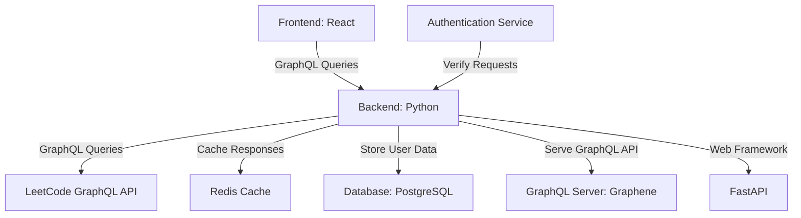

# LeetCode Analytics Dashboard

This project aims to create a comprehensive analytics dashboard for LeetCode users, providing insights into their performance, progress, and areas for improvement. It utilizes a Python backend with FastAPI and Graphene to fetch and serve data from the LeetCode API, and will eventually include a React frontend for data visualization.

## Project Goals

1. Tracking day-to-day changes in ranking (positive or negative)
2. Visualizing ranking by region, state, or country
3. Analyzing performance across different skill areas (algorithms, data structures)
4. Identifying strengths and suggesting areas for upskilling
5. Providing insights into contest performance

## Project Architecture


This diagram illustrates the architecture of the LeetCode User Dashboard application, featuring a React frontend and a Python backend with FastAPI and Graphene.

## Features

- GraphQL API to fetch comprehensive LeetCode user data
- Daily ranking change tracking
- Regional and global ranking comparisons
- Skill area analysis based on problem tags
- Contest performance tracking

## Planned Features

- Interactive frontend dashboard for data visualization
- Personalized improvement suggestions based on performance analysis
- Graphical representation of skill areas and progress
- Detailed contest analysis and comparison
- Integration with learning resources for suggested upskilling areas

## Technology Stack

### Backend
- Python 3.9+
- FastAPI: Web framework for building APIs
- Graphene: GraphQL framework for Python
- PostgreSQL: Database for storing user data
- Redis: Caching layer
- Uvicorn: ASGI server

### Frontend (Planned)
- React:
- Storybook:

## Prerequisites

Before you begin, ensure you have met the following requirements:
- Python 3.7 or higher installed
- pip (Python Package Installer) installed
- PostgreSQL installed and running
- Redis installed and running

## Installation

To set up the LeetCode Analytics Dashboard, follow these steps:

1. Clone the repository:
   ```
   git clone https://github.com/yourusername/leetcode-analytics-dashboard.git
   ```

2. Navigate to the project directory:
   ```
   cd leetcode-analytics-dashboard
   ```

3. Create a virtual environment:
   ```
   python3 -m venv venv
   ```

4. Activate the virtual environment:
   - On Windows: `venv\Scripts\activate`
   - On macOS and Linux: `source venv/bin/activate`
   

5. Install the dependencies:
   ```
   pip install -r requirements.txt
   ```

## Usage

To run the GraphQL server:

1. Make sure you're in the project directory with your virtual environment activated.

2. Start the FastAPI server:
   ```
   uvicorn main:app --reload
   ```

3. Once the server starts, you'll see a message like:
   ```
   INFO:     Uvicorn running on http://127.0.0.1:8000 (Press CTRL+C to quit)
   ```

4. Open the provided URL in your browser and append `/graphql` to access the GraphQL Playground (e.g., http://127.0.0.1:8000/graphql).

5. In the Playground, you can run queries. For example:
   ```graphql
   query {
     leetcodeProfile {
       ranking
     }
   }
   ```

6. Click the "Play" button or press Ctrl+Enter to execute the query.

7. To stop the server, press Ctrl+C in the terminal.

## Configuration

...
## Development

...


## License

This project uses the MIT License.